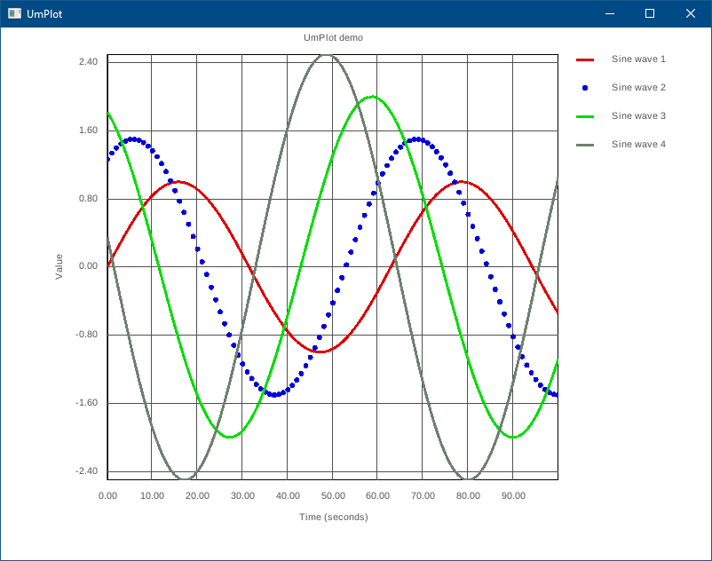

# UmPlot
UmPlot: A plotting library for [Umka](https://github.com/vtereshkov/umka-lang) based on [raylib](https://www.raylib.com).

## Example
```
import "umplot.um"

fn main() {
    plt := umplot.init(4)

    for x := 0.0; x <= 100.0; x += 1.0 {
        for i := 0; i < 4; i++ {
            y := (1 + 0.5 * i) * sin(x / 10.0 + i)
            plt.series[i].add(x, y)
        }
    }

    plt.series[1].style.kind = umplot.STYLE_SCATTER

    plt.plot()
}
```


